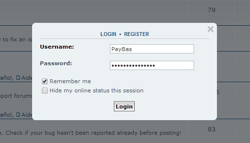

# Quick Login extension for phpBB

Extension for phpBB 3.2 that adds a simple quick login popup lightbox using JavaScript.

## Minimum Requirements
* phpBB 3.2.6
* PHP 5.4

## Features
- Just a simple lightbox popup for quick login actions.
- Changes the behaviour of the normal login button in the header.
- Only activates on pages where there is no normal login form (not when trying to access the UCP for example).

## Install
1. [Download the latest release](https://github.com/david63/quicklogin/archive/3.2.zip) and unzip it.
2. Unzip the downloaded release and copy it to the `ext` directory of your phpBB board.
3. Navigate in the ACP to `Customise -> Manage extensions`.
4. Look for `Quick Login` under the Disabled Extensions list and click its `Enable` link.

## Uninstall
1. Navigate in the ACP to `Customise -> Manage extensions`.
2. Click the `Disable` link for `Quick Login`.
3. To permanently uninstall, click `Delete Data`, then delete the quicklogin folder from `phpBB/ext/paybas/`.

## License
[GNU General Public License v2](http://opensource.org/licenses/GPL-2.0)

© 2019 - David Wood